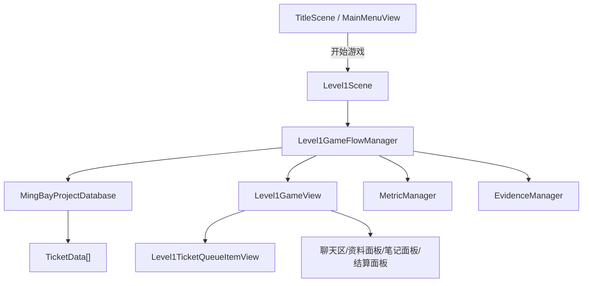

# 《明湾72h》教程关系统与逻辑调用说明

本文用于给接手开发者搭建教程关时参考。当前项目的正式第一夜内容已经由配置表导入为 `TicketData.asset` 与 `MingBayProjectDatabase.asset`，但教程关工单内容不在当前配置表中。教程关可以复用现有 UI、工单数据结构、流程管理器和指标系统，也可以写独立教程控制器直接调用 `Level1GameView`。

## 当前结论

- 正式关卡运行时不读 Excel，也不读 SQLite。当前运行时读取 Unity `ScriptableObject` 资产。
- 当前主数据库是 `Assets/Configs/MingBayProjectDatabase.asset`，类型为 `MingBayProjectDatabase`。
- 当前配置表导入产物是 `Assets/Configs/Tickets/Ticket_N1_T01.asset` 到 `Ticket_N1_T04.asset`。
- 当前配置表源数据已经整理为 `Assets/Configs/Spreadsheet/MingBaySpreadsheetConfig.json`。
- `Level1SceneBuilder` 会读取该 JSON 并生成/更新正式关卡数据。只要 JSON 存在且有效，它会优先使用配置表数据。
- 当前生成器固定导入 `CurrentSpreadsheetLevelId = "N1"`，并且生成后校验“只包含 4 张第一夜工单，不包含 `Stage_Tutorial` 工单”。
- 教程关内容不要直接塞进当前 `N1` 配置表，除非同步修改导入器和数据库阶段顺序。

## 运行时系统结构



`MainMenuView` 只负责标题界面的按钮和进入 `Level1Scene`。进入游戏后，`Level1GameFlowManager.Start()` 会重置证据和指标，然后按照数据库的阶段顺序读取工单，调用 `Level1GameView` 显示队列和具体 UI。

## 核心流程

1. `Level1GameFlowManager.StartGame()`
   重置 `EvidenceManager`、`MetricManager`，读取数据库阶段顺序。

2. `LoadNextStage()`
   通过 `database.GetTicketsByStage(stageId)` 获取当前阶段工单，构建左侧工单队列。

3. `ShowTicketSelection()`
   设置状态为 `TicketSelection`，等待玩家点击左侧工单。

4. `HandleTicketSelected(index)`
   加载当前 `TicketData`，清空临时证据选择，设置状态为 `ReadingTicket`，调用 `Level1GameView.ShowTicket()`。

5. `Level1GameView.ShowTicket()`
   显示工单资料头部，并播放 `InitialDialogueLines`。如果该数组为空，则退回使用 `UserMessage + AiReply`。

6. 玩家点击 `资料库查找`
   `Level1GameView` 触发 `ViewDataRequested`，`Level1GameFlowManager.HandleViewDataRequested()` 进入 `ReviewingData`，调用 `ShowData()` 展开资料面板。

7. 玩家点击资料块
   `Level1GameView` 触发 `EvidenceSelected(index)`。在 `ReviewingData` 下会记录 `selectedEvidenceIndex`，并显示“查看资料详情/收集此资料”按钮。

8. 玩家点击 `收集此资料`
   `SaveEvidenceRequested` 进入 `HandleSaveEvidenceRequested()`，把资料序号加入 `retainedEvidenceIndices`。这一步只是保留资料，不结算。

9. 玩家点击 `转人工`
   如果工单 `RequiresEvidenceSelection = true` 且没有收集资料，会提示先收集资料。已收集资料后，先播放 `TransferDialogueLines`，播放完再打开笔记面板。

10. 玩家在笔记面板选择资料并提交
    `ChatEvidenceActionRequested` 进入 `HandleChatEvidenceActionRequested()`，比较资料序号是否等于 `CorrectEvidenceIndex`，应用正确/错误指标，播放 `EvidenceCorrectDialogueLines` 或 `EvidenceWrongDialogueLines`，对话全部播放完后再结算。

11. 玩家长按 `标记已解决`
    `Level1GameView` 的长按读条达到 `markResolvedHoldSeconds` 后触发 `MarkResolvedRequested`。`Level1GameFlowManager.HandleMarkResolvedRequested()` 会直接应用 `ResolvedMetricDelta` 并进入结算。

12. 结算
    `FinishTicket()` 标记当前工单已处理，刷新队列状态，显示结果面板。关闭结果后，如果本阶段还有未处理工单则返回队列；否则尝试进入下一阶段，没有下一阶段则返回标题界面。

## 配置表使用方法

当前项目不是直接从 `.xlsx` 运行，而是先把表格整理为 JSON，再由 Unity 编辑器工具生成资产。

配置表 JSON 路径：

```text
Assets/Configs/Spreadsheet/MingBaySpreadsheetConfig.json
```

导入工具：

```text
Assets/Editor/Level1SceneBuilder.cs
Unity 菜单：明湾/场景工具/生成基础工单 Demo
批处理方法：MingBay.Editor.Level1SceneBuilder.Build
```

生成结果：

```text
Assets/Configs/Tickets/Ticket_N1_T01.asset
Assets/Configs/Tickets/Ticket_N1_T02.asset
Assets/Configs/Tickets/Ticket_N1_T03.asset
Assets/Configs/Tickets/Ticket_N1_T04.asset
Assets/Configs/MingBayProjectDatabase.asset
Assets/Scenes/Level1Scene.unity
```

### JSON 顶层字段

| 字段 | 用途 |
| --- | --- |
| `levels` | 阶段配置。当前运行只导入 `N1`。 |
| `users` | 用户信息。通过 `ticket.userId` 关联。 |
| `tickets` | 工单主表。决定工单 ID、阶段、排序、标题、分类、原始诉求等。 |
| `dataPanels` | 资料面板。通过 `ticketId + panelOrder` 关联到一张工单。 |
| `dialogues` | 聊天气泡文本。通过 `ticketId + trigger` 关联，按 `order` 升序播放。 |
| `actions` | 操作结果指标。通过 `actionType` 映射到 `MetricDelta`。 |
| `evidenceChains` | 预留证据链配置。当前第一夜导入主要使用硬编码正确资料序号，暂未完整按该表驱动。 |

### `levels`

重要字段：

| 字段 | 当前含义 |
| --- | --- |
| `levelId` | 阶段 ID，例如 `N1`。会写入 `TicketData.StageId`，也会写入数据库的 `stageOrder`。 |
| `levelNameCn` | 阶段显示名，例如 `第一夜`。 |
| `ticketCount` | 策划校验用数量。当前运行实际以导入到数据库的工单数量为准。 |
| `hasKeywordDrag` | 后续关卡机制标识，当前第一夜未使用。 |
| `evidenceTemplateId` | 后续证据链模板标识，当前第一夜未使用。 |
| `nextLevelId` | 后续扩展阶段使用，当前 `Level1GameFlowManager` 主要看数据库 `stageOrder`。 |

### `users`

通过 `userId` 被 `tickets.userId` 引用。

| 字段 | 导入到哪里 |
| --- | --- |
| `userNameCn` | `TicketData.userName`，也作为用户气泡 speaker label。 |
| `addressCn` | `TicketData.region`。 |
| `accountStatusCn`、`residentVerifyCn` | 当前主要通过资料面板文本体现，不单独进入运行时字段。 |
| `firstTicketId` | 表格校验或后续扩展使用，当前第一夜导入不依赖它排序。 |

### `tickets`

只导入满足以下条件的工单：

```text
levelId == "N1"
status == "ACTIVE"
```

导入时按 `orderInLevel` 升序排列。

| 字段 | 导入到哪里 |
| --- | --- |
| `ticketId` | `TicketData.ticketId`，资产路径为 `Assets/Configs/Tickets/Ticket_{ticketId}.asset`。 |
| `levelId` | `TicketData.stageId`。 |
| `orderInLevel` | 决定数据库内顺序和左侧队列顺序。 |
| `userId` | 关联 `users`。 |
| `ticketTitleCn` | `TicketData.title`。 |
| `ticketCategoryCn` | `TicketData.issueType`。 |
| `initialUserRequestCn` | 当 `INIT` 对话缺失时，作为 `userMessage` 兜底。 |
| `aiAutoReplyCn` | 当 `INIT` 对话缺失时，作为 `aiReply` 兜底。 |
| `askReplyCn` | 当 `ASK` 对话缺失时，作为追问文本兜底。 |
| `maxAskCount` | 大于 1 时会把追问文本拆成多条 `followUpLines`。 |
| `correctManualResultCn` | 正确证据后的结果文本 `OnSaveEvidenceText`。 |
| `autoClearResultCn` | 直接标记已解决后的结果文本 `OnResolvedText`。 |

### `dataPanels`

通过 `ticketId` 关联工单，通过 `panelOrder` 对应四个资料块。

| `panelOrder` | 导入字段 | UI 显示 |
| --- | --- | --- |
| `1` | `profileText` | 资料01 |
| `2` | `historyText` | 资料02 |
| `3` | `deviceLogText` | 资料03 |
| `4` | `regionStatusText` | 资料04 |

导入时会清理文本首尾空白，并在资料正文中去掉以“资料”开头的首行标题，避免 UI 标题和正文重复。

### `dialogues`

通过 `ticketId + trigger` 取数据，按 `order` 升序播放。`order >= 900` 的行会被导入器忽略，可用于表格里的废弃行、备注行或暂不启用行。

当前使用的 `trigger`：

| Trigger | 触发时机 | 写入字段 |
| --- | --- | --- |
| `INIT` | 玩家打开工单后自动播放 | `initialDialogueLines` |
| `ASK` | 玩家点击追问 | `followUpLines` |
| `ON_TRANSFER` | 玩家点击转人工后，笔记面板弹出前 | `transferDialogueLines` |
| `EVIDENCE_CORRECT` | 提交正确证据后 | `evidenceCorrectDialogueLines` |
| `EVIDENCE_WRONG` | 提交错误证据后 | `evidenceWrongDialogueLines` |

`speakerId` 规则：

| `speakerId` | UI 标签 | 气泡方向 |
| --- | --- | --- |
| `AI` | `明湾通 AI` | 右侧/系统侧 |
| `A07` | `客服 A-07` | 右侧/系统侧 |
| 以 `User` 开头 | 当前工单用户姓名 | 左侧/用户侧 |
| 其他 | 原样显示 | 默认按非用户处理 |

注意：所有与对话相关的弹窗都应该等 `Level1GameView.PlayTicketDialogue(..., onComplete)` 的 `onComplete` 回调触发后再弹出。当前转人工笔记面板和提交证据后的结算面板都遵守这个规则。

### `actions`

当前导入器通过 `actionType` 找到动作配置，并写入 `TicketData` 的指标变化字段。

| `actionType` | 写入字段 | 当前触发 |
| --- | --- | --- |
| `ASK` | `followUpMetricDelta` | 首次追问时应用 |
| `TRANSFER` | `transferMetricDelta` | 首次转人工时应用 |
| `EVIDENCE_CORRECT` | `correctEvidenceMetricDelta` | 提交正确证据时应用 |
| `EVIDENCE_WRONG` | `wrongEvidenceMetricDelta` | 提交错误证据时应用 |
| `AUTO_CLEAR` | `resolvedMetricDelta` | 长按标记已解决时应用 |

当前 `SetMetricDeltaFromAction` 的映射方式比较简单：如果该分支会关闭工单，则 `resolvedCount = 1`；`transferCount` 读取 `manualTransferCountDelta`；`a07Risk` 读取 `riskValueDelta`；用户满意度暂未从配置表写入。

### 正确证据序号

当前第一夜正确证据序号还没有完全从 `evidenceChains` 驱动，而是在 `Level1SceneBuilder.GetFirstNightCorrectEvidenceIndex()` 中临时指定：

| 工单 | 正确资料 |
| --- | --- |
| `N1_T02` | 资料02，对应 `correctEvidenceIndex = 1` |
| 其他 N1 工单 | 资料04，对应 `correctEvidenceIndex = 3` |

如果后续需要让配置表完全控制正确证据，应把 `correctChainId` 或 `evidenceChains` 转换为 `TicketData.correctEvidenceIndex`，并移除这段硬编码。

## 教程关搭建建议

当前需求是“教程关工单内容不在配置表中”。建议不要改 `MingBaySpreadsheetConfig.json` 来放教程文本，而是选择以下两种方案之一。

### 方案 A：教程关仍使用 `TicketData`，但手工/程序生成教程资产

适合希望复用完整工单流程、左侧队列、资料面板、笔记面板和结算面板的教程。

做法：

1. 生成教程工单资产，例如：

```text
Assets/Configs/Tickets/Ticket_Tutorial_01.asset
Assets/Configs/Tickets/Ticket_Tutorial_02.asset
```

2. 每个教程工单仍然是 `TicketData`，但 `stageId` 使用独立阶段，例如：

```text
Stage_Tutorial
```

3. 修改或生成一个教程专用数据库资产，例如：

```text
Assets/Configs/TutorialDatabase.asset
```

或者把教程工单加入 `MingBayProjectDatabase.asset`，并将 `stageOrder` 改为：

```text
Stage_Tutorial
N1
```

4. 注意当前 `Level1SceneBuilder.Build()` 会重新生成 `MingBayProjectDatabase.asset`，并把 `stageOrder` 重置为 `N1`。如果采用此方案，需要避免每次生成正式关卡时覆盖教程数据库，或把教程数据库做成独立资产并在教程场景/控制器中引用。

5. 教程工单常用字段建议：

| 字段 | 教程用途 |
| --- | --- |
| `ticketId` | 使用稳定 ID，例如 `TUTORIAL_01`，不要复用 `N1_Txx`。 |
| `stageId` | 使用 `Stage_Tutorial`。 |
| `initialDialogueLines` | 玩家打开教程工单后自动播放的用户和 AI 气泡。 |
| `followUpLines` | 引导玩家点击追问。 |
| `profileText` 到 `regionStatusText` | 四个资料块，可只填教程需要的资料。 |
| `requiresEvidenceSelection` | 需要教学证据时设为 `true`。 |
| `allowDirectEvidenceSave` | 如果要教学“先收集资料，再转人工”，设为 `true`。 |
| `finishOnEvidenceSubmission` | 如果正确证据后还要教学“长按标记已解决”，可设为 `false`。 |
| `hasEvidence` | 有正确资料时设为 `true`。 |
| `correctEvidenceIndex` | 0 到 3，对应资料01到资料04。 |
| `resolvedMetricDelta` | 长按标记已解决后增加已解决数量，通常 `resolvedCount = 1`。 |

### 方案 B：写独立教程控制器，直接调用 `Level1GameView`

适合需要强制步骤、遮罩、点击高亮、逐步解锁按钮的教程。

做法：

1. 新增一个 `TutorialFlowManager` 或类似脚本。
2. 在场景中引用 `Level1GameView`、`MetricManager`、`EvidenceManager`。
3. 不让 `Level1GameFlowManager` 同时控制教程 UI，避免两个流程控制器抢状态。
4. 教程控制器可以直接调用：

```csharp
mainGameView.ShowTicketSelection(...);
mainGameView.ShowTicket(ticketData, ...);
mainGameView.ShowData(ticketData);
mainGameView.PlayTicketDialogue(lines, false, OnDialogueComplete);
mainGameView.ShowEvidenceNotebook(ticketData, retainedEvidenceIndices);
mainGameView.ShowResult(...);
```

5. 通过订阅 `Level1GameView` 事件推进教程步骤：

```csharp
mainGameView.ViewDataRequested += OnViewDataRequested;
mainGameView.FollowUpRequested += OnFollowUpRequested;
mainGameView.EvidenceSelected += OnEvidenceSelected;
mainGameView.SaveEvidenceRequested += OnSaveEvidenceRequested;
mainGameView.TransferHumanRequested += OnTransferHumanRequested;
mainGameView.ChatEvidenceActionRequested += OnSubmitEvidenceRequested;
mainGameView.MarkResolvedRequested += OnMarkResolvedRequested;
```

6. 这种方案下，教程内容可以是代码内构造的 `TicketData`、单独的 `ScriptableObject`，或自定义 JSON。只要最终能给 `Level1GameView` 提供一个 `TicketData` 和对话行即可。

## 教程关可能涉及的脚本

### `Assets/Scripts/Data/TicketData.cs`

一张工单的全部静态数据。教程关如果复用工单系统，最核心就是生成或填写这个资产。

包含内容：

- 基础信息：工单 ID、阶段 ID、标题、用户名、区域、问题类型、等待时间。
- 聊天内容：初始对话、转人工对话、正确证据对话、错误证据对话。
- 四个资料块：用户资料、历史工单、AI 处理建议、设备或系统日志。
- 流程开关：是否需要证据、是否允许直接保留证据、提交证据后是否直接完成。
- 证据规则：证据 ID、正确证据序号。
- 处理结果：正确证据结果、错误证据结果、标记已解决结果。
- 指标变化：追问、转人工、正确证据、错误证据、标记已解决。

### `Assets/Scripts/Data/MingBayProjectDatabase.cs`

项目运行时数据库。`Level1GameFlowManager` 从这里读取工单列表和阶段顺序。

关键功能：

- `Tickets`：保存当前可用工单资产列表。
- `StageOrderArray`：阶段推进顺序。
- `GetTicketsByStage(stageId)`：返回某个阶段下的工单。
- `GetStageDisplayName(index)`：返回阶段显示名。

教程关如果使用方案 A，需要让教程工单出现在这个数据库或教程专用数据库中。

### `Assets/Scripts/Core/Level1GameFlowManager.cs`

当前正式流程总控。它不直接生成 UI，而是响应 `Level1GameView` 的事件并调用对应显示方法。

关键职责：

- 开始游戏时重置证据和指标。
- 按阶段加载工单。
- 处理点击工单、查看资料、追问、转人工、收集资料、提交证据、长按标记已解决。
- 控制对话播放后再弹出笔记面板或结算面板。
- 防止结算阶段重复提交或切换工单。

教程关如果只是普通工单，可直接复用它。若需要更强制的新手引导，建议新写教程控制器，不要在 `Level1GameFlowManager` 中塞太多特例。

### `Assets/Scripts/Core/Level1GameState.cs`

工单流程状态枚举。

当前状态：

- `TicketSelection`：等待选择工单。
- `ReadingTicket`：已打开工单，正在阅读聊天。
- `ReviewingData`：资料面板已打开，可追问、收集资料、转人工。
- `AwaitingEvidence`：等待直接选择证据。
- `AwaitingEvidencePresentation`：已转人工，笔记面板等待提交已收集资料。
- `AwaitingDialogueCompletion`：证据结果对话播放中，播放完才结算。
- `ShowingResult`：结算面板显示中。

教程控制器如果复用 `Level1GameFlowManager`，需要遵守这些状态限制。

### `Assets/Scripts/Core/EvidenceManager.cs`

运行时证据记录器。

功能：

- 用 `HashSet<string>` 记录已经保存的证据 ID。
- `SaveEvidence(evidenceId)` 会防止同一个证据重复计数。
- `ResetEvidence()` 在新游戏开始时清空。
- `EvidenceCount` 用于结算面板显示本次证据记录。

教程关如果有“收集证据”教学，需要决定是否让教程证据计入正式证据数量。

### `Assets/Scripts/Core/MetricManager.cs`

运行时指标记录器。

功能：

- 记录已解决数量、人工转接次数、用户满意度、A-07 风险值。
- `Apply(MetricDelta)` 应用一次操作的影响。
- `GetSnapshot(evidenceCount)` 给 UI 结算和状态栏读取。

教程关如果只是教学，可能需要让指标变化为 0，避免教程污染正式第一夜数据；如果教程也算进总进度，则在教程 `TicketData` 的 `MetricDelta` 中配置。

### `Assets/Scripts/Data/MetricDelta.cs`

单次操作造成的指标变化。

字段：

- `resolvedCount`
- `transferCount`
- `userSatisfaction`
- `a07Risk`

正式关卡从配置表 `actions` 导入。教程关可以直接在 `TicketData` Inspector 或程序生成时填写。

### `Assets/Scripts/UI/Level1GameView.cs`

主游戏 UI 控制层。它负责显示和按钮事件，但不负责判断游戏逻辑。

重要事件：

- `TicketSelected`
- `ViewDataRequested`
- `FollowUpRequested`
- `TransferHumanRequested`
- `SaveEvidenceRequested`
- `ChatEvidenceActionRequested`
- `EvidenceSelected`
- `NotebookCancelRequested`
- `MarkResolvedRequested`
- `ResultActionRequested`

重要显示方法：

- `BuildTicketQueue()`
- `ShowTicketSelection()`
- `ShowTicket()`
- `ShowData()`
- `ShowResidentFollowUp()`
- `ShowEvidenceNotebook()`
- `HideEvidenceNotebook()`
- `PlayTicketDialogue()`
- `ShowResult()`

重要节奏参数：

- `dialogueRevealDelay`：对话与对话之间的停留时间。
- `popupDelayAfterDialogueSeconds`：对话完全结束后到弹窗出现的延迟。
- `markResolvedHoldSeconds`：长按“标记已解决”的触发时间，当前默认为 1 秒。

### `Assets/Scripts/UI/Level1TicketQueueItemView.cs`

左侧单条工单队列项。

功能：

- 展示工单编号、类型、用户、选中状态、已解决状态。
- 绑定按钮点击，向 `Level1GameView` 返回工单序号。
- 已处理工单会自动禁用。

教程关如果需要在左侧队列中只显示一条教学工单，仍可复用该脚本。

### `Assets/Scripts/UI/MainMenuView.cs`

标题界面控制器。

功能：

- 开始新游戏、继续游戏、设置、开发人员、退出等标题按钮的基础入口。
- 当前核心逻辑是点击开始按钮后加载 `Level1Scene`。
- 实时时间文本会在标题界面刷新。

教程关如果要从标题界面先进入教程场景，可以调整 `gameSceneName` 或新增按钮逻辑。

### `Assets/Editor/Level1SceneBuilder.cs`

编辑器生成器，不参与运行时。

功能：

- 读取 `MingBaySpreadsheetConfig.json`。
- 生成/更新 `TicketData.asset`。
- 生成/更新 `MingBayProjectDatabase.asset`。
- 重新创建 `Level1Scene.unity` 的 UI 框架和绑定。
- 验证数据库、场景引用和第一夜工单数量。

注意：

- 当前 `CurrentSpreadsheetLevelId = "N1"`。
- 当前 `CreateOrUpdateDatabase()` 会把数据库阶段顺序写为 `N1`。
- 当前 `ValidateGeneratedContent()` 要求数据库不包含 `Stage_Tutorial`，且第一夜有 4 张工单。
- 因此，教程关如果要独立存在，最好不要让该生成器覆盖教程数据。

### `Assets/Editor/TitleSceneBuilder.cs`

标题界面生成器，不参与运行时。

功能：

- 生成 `TitleScene.unity` 的标题、开始、继续、设置、开发人员、退出按钮。
- 绑定 `MainMenuView`。

教程关如果需要标题界面新增“教程”入口，可以在这里扩展按钮和绑定。

## 推荐给教程关程序的接入顺序

1. 先决定教程关是否复用 `Level1GameFlowManager`。
2. 如果复用，生成教程 `TicketData` 资产，并准备教程数据库或修改数据库阶段顺序。
3. 如果不复用，新增 `TutorialFlowManager`，只复用 `Level1GameView`、`MetricManager`、`EvidenceManager`。
4. 教程步骤必须等 `PlayTicketDialogue` 的 `onComplete` 后再弹窗或解锁下一步。
5. 教程中需要收集资料时，沿用“四个资料块 + `correctEvidenceIndex`”模型，资料序号从 0 开始。
6. 长按标记已解决不要直接监听按钮 `onClick`，应通过 `Level1GameView.MarkResolvedRequested`。
7. 不要在运行时直接读取 Excel；如需读配置，请读项目内 JSON 或 ScriptableObject。
8. 如果教程不应影响正式第一夜指标，教程 `MetricDelta` 均设为 0，并在进入正式关前调用 `MetricManager.ResetMetrics()` 和 `EvidenceManager.ResetEvidence()`。

## 最小教程关数据示例

下面是一个教程工单应具备的逻辑结构，具体创建方式可由外部程序写 `ScriptableObject` 资产或自定义导入器实现。

```text
ticketId: TUTORIAL_01
stageId: Stage_Tutorial
title: 第一次处理工单
userName: 教程用户
region: 教程区域
issueType: 教程
initialDialogueLines:
  1. User_Tutorial / 教程用户 / 我需要帮助 / fromUser=true
  2. AI / 明湾通 AI / 已检测到您的需求 / fromUser=false
profileText: 资料01正文
historyText: 资料02正文
deviceLogText: 资料03正文
regionStatusText: 资料04正文
followUpLines:
  1. 用户补充说明
transferDialogueLines:
  1. AI / 已转人工部门继续处理 / fromUser=false
  2. A07 / 您好，《明湾通》A07客服在线为您服务 / fromUser=false
requiresEvidenceSelection: true
allowDirectEvidenceSave: true
finishOnEvidenceSubmission: false
hasEvidence: true
evidenceId: E_TUTORIAL_01
correctEvidenceIndex: 0
onSaveEvidenceText: 证据有效
onWrongEvidenceText: 证据不匹配，请重新查看资料
onResolvedText: 教程工单已关闭
```

## 常见注意点

- `correctEvidenceIndex` 是 0 基序号，不是 1 基。资料01 对应 0。
- `dialogues` 的 `order` 必须能正确升序，否则气泡顺序会错。
- `User` 开头的 `speakerId` 会被认为是用户侧气泡。
- `AI` 和 `A07` 会被认为是系统/客服侧气泡。
- 转人工后，笔记面板只显示已经“收集此资料”的资料。
- 提交证据后的结算必须等对应对话全部播放完。
- `markResolvedButton` 是长按触发，不是普通点击触发。
- `Level1SceneBuilder.Build()` 会覆盖 `Level1Scene.unity` 和正式数据库，教程关自动生成器要避开这个覆盖行为。
